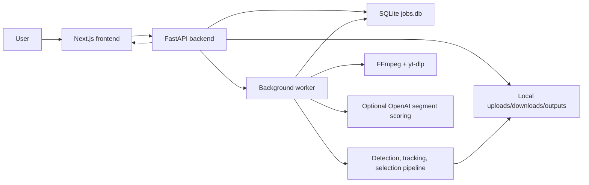

# PowerPlay Technical Design

Status: implementation-aligned design document based on the active code paths in the repository as of 2026-04-24.

Important note: this document intentionally treats the Python/FastAPI backend as the current runtime source of truth. The legacy Node/Express files and some top-level README content are retained in the repo but do not match the active frontend integration.

## 1. Runtime Architecture

## 2. Main Components

### Frontend

- Framework: Next.js App Router
- Language: TypeScript + React 19
- Responsibilities:
  - marketing site and pricing presentation
  - upload and practice-mode forms
  - job polling and progress display
  - result playback and download actions

Key pages:

- `frontend/app/page.tsx`
- `frontend/app/upload/page.tsx`
- `frontend/app/practice-mode/page.tsx`
- `frontend/app/how-it-works/page.tsx`

### Active backend

- Framework: FastAPI
- Main entrypoint: `backend/main.py`
- Responsibilities:
  - accept video uploads or YouTube URLs
  - validate inputs
  - enqueue match-highlight jobs
  - expose job status
  - run practice mode analysis
  - serve generated output files

### Background processing

- Worker entrypoint: `backend/worker.py`
- Responsibilities:
  - read queued jobs from `jobs.db`
  - download/prepare footage
  - run detection, tracking, scoring, selection, and compilation
  - persist status, progress, result metadata, and failure information

### Local persistence

- Job state: `backend/jobs.db` via `backend/job_store.py`
- Media directories:
  - `uploads/`
  - `downloads/`
  - `outputs/`

## 3. Public API Surface

### Health and base routes

- `GET /`
- `GET /health`

### Match-highlight routes

- `POST /jobs`
- `POST /process-video`
- `GET /jobs/{job_id}`

`/process-video` is the backwards-compatible route used by the current frontend. It immediately returns a job ID and instructs the client to poll `/jobs/{job_id}`.

### Practice-mode route

- `POST /practice-mode`

Unlike the match-highlight path, practice mode currently performs analysis inside the request lifecycle and returns a final response directly.

## 4. Match Highlight Flow

### Request contract

Expected multipart form fields include:

- `video` or `youtube_url`
- `playerData` as JSON
- `action`
- `scope`
- `start_time`
- `end_time`
- `frame_skip`
- `detect_every_n_frames`
- `resize_scale`
- `yolo_model`
- `save_dataset`
- `prefer_deepsort`
- `dev_test_mode`

### Backend sequence

1. Frontend submits `POST /process-video`.
2. FastAPI parses form data and normalizes player/team mode state.
3. Uploaded files are saved locally, or YouTube metadata is stored for worker-side download.
4. `JobStore.create_job()` persists the request payload with queued status.
5. Worker reads the queued job and updates status over time.
6. Depending on source:
   - upload: uses saved file directly
   - YouTube: downloads a target file or sections using `yt-dlp`
7. Optional trimming is applied via FFmpeg if timestamps were provided.
8. Detection and tracking modules produce candidate player segments.
9. Segment scoring/filtering/refinement modules reduce noise and suppress likely replay material.
10. Final clips are compiled into a highlight output.
11. Worker stores `output_url`, `output_path`, and result metadata.
12. Frontend polls until it receives `done` or `failed`.

### Status model

The system exposes both coarse job status and more specific stage text. The current frontend is prepared to render stages such as:

- queued
- preparing
- downloading
- detecting
- tracking
- scoring
- filtering
- compiling
- done
- failed

## 5. Practice Mode Flow

Practice mode is optimized for long recordings with sparse action.

### Request contract

Expected form fields include:

- `video` or `youtube_url`
- `practice_type`
- `video_length`
- `desired_clip_length`
- `movement_threshold`
- `min_movement_duration`
- `padding_before`
- `padding_after`
- `output_mode`

### Processing path

1. FastAPI receives `/practice-mode`.
2. Source video is saved or downloaded.
3. `analyze_cricket_practice_session(...)` is called with the accepted parameters.
4. The movement detector finds active windows.
5. Overlapping windows are merged.
6. FFmpeg extracts clips or compiles a single highlight output.
7. Temporary input files are cleaned up before returning the response.

## 6. Core Processing Modules

### Utility layer

- `backend/processing/utils.py`
  - timecode parsing
  - duration helpers
  - segment merging/clamping/capping
  - file saving

### Match-highlight pipeline

- `backend/processing/detect_player.py`
- `backend/processing/track_player.py`
- `backend/processing/deepsort_track.py`
- `backend/processing/segment_selector.py`
- `backend/processing/highlight_scorer.py`
- `backend/processing/compile_clips.py`

### Practice mode

- `backend/processing/practice_mode.py`

### Benchmarking and dataset capture

- `backend/tools/benchmark_pipeline.py`
- `backend/processing/ml/highlight_dataset.py`
- `backend/processing/ml/train_highlight_model.py`

## 7. Job Persistence Design

`backend/job_store.py` stores jobs in SQLite with fields for:

- `id`
- `status`
- `stage`
- `message`
- `download_percent`
- `progress`
- `output_url`
- `output_path`
- `request_json`
- `result_json`
- `error`
- `created_at`
- `updated_at`

The store is intentionally simple and works well for local development and a single worker loop. It is not a replacement for a distributed queue or production-grade shared job system.

## 8. Storage Layout

The current backend mounts local directories as static file roots:

- `/outputs`
- `/uploads`
- `/downloads`

This makes local development straightforward, but it couples runtime state to local disk and assumes a single machine for both processing and file serving.

## 9. Operational Configuration

The codebase uses a mix of explicit form parameters and environment variables for runtime tuning. Examples include:

- `PP_ENABLE_ADAPTIVE_SCAN`
- `PP_YTDLP_MAX_HEIGHT`
- `PP_YTDLP_CONCURRENT_FRAGS`
- `PP_REPLAY_SUPPRESS_THRESHOLD`
- `PP_SEGMENT_DEDUPE_IOU`
- `OPENAI_API_KEY`
- `OPENAI_VISION_MODEL`

This allows performance and ranking changes without rewriting the pipeline, but it also means runtime behavior can drift if configuration is not documented centrally.

## 10. Known Technical Debt

- The root and backend READMEs describe an Express-based backend that is not the active frontend target.
- The repo currently mixes legacy Node backend code with the active Python backend.
- Practice mode is synchronous while match highlights are queued and polled.
- The local output directories and SQLite database are not production-ready shared infrastructure.
- Formal automated test coverage is minimal in the current repo state.

## 11. Recommended Next Steps

1. Align top-level documentation with the active FastAPI architecture.
2. Add unit and integration tests around job creation, status polling, and pure segment utilities.
3. Separate legacy Node code from the active path or mark it explicitly as archived.
4. Move long-running storage and job coordination to production-capable services once multi-user hosting is required.
